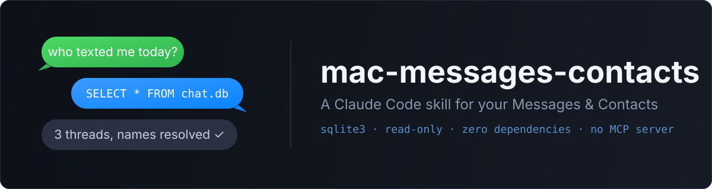
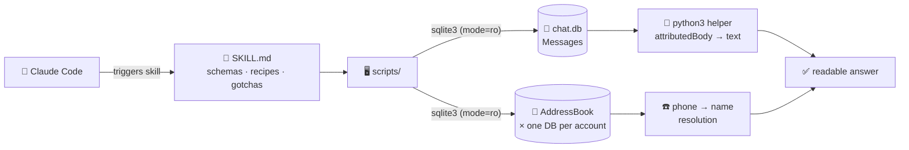

<div align="center">



<br/><br/>

[](https://claude.com/claude-code)
[](#requirements)
[](LICENSE)
[](#requirements)
[](#safety--privacy)
[](#scripts)

**Let Claude query your macOS Messages history and Contacts directly via SQLite —<br/>no MCP server, no dependencies beyond what ships with macOS.**

</div>

---

Ask things like:

> 💬 *"Who texted me this morning?"*
> 📖 *"Read my last 20 messages with Mom"*
> 📇 *"What's Tyler's phone number?"*
> 🔍 *"Which numbers in my recent texts aren't saved in my contacts?"*

## How it works



[`SKILL.md`](SKILL.md) is the skill definition Claude loads: database locations,
schema reference for `chat.db` and `AddressBook-v22.abcddb`, query recipes, and a
troubleshooting table. The scripts handle the fiddly parts — Apple epoch
conversion, binary blob extraction, phone-number normalization, and multi-source
contact resolution.

## Why this exists

The Messages and Contacts databases are just SQLite files, but naive queries fail
in quiet, confusing ways. This skill packages working queries plus the **seven
gotchas** that cost real debugging time:

| # | Gotcha | Symptom if you miss it |
|---|--------|------------------------|
| 1 | Sandboxed shells can't open anything under `~/Library` | `unable to open database file` |
| 2 | Full Disk Access required on top of that | Same error, outside the sandbox |
| 3 | Contacts split across **one DB per account** (iCloud, Google, …) | Saved contacts silently "not found" |
| 4 | `chat.display_name` is `''`, not `NULL`, for direct chats | Blank conversation names |
| 5 | Timestamps are nanoseconds since **2001-01-01** (Apple epoch) | Dates in the year 55977 |
| 6 | Sent-message text hides in the `attributedBody` binary blob | Your own messages appear empty |
| 7 | macOS `/bin/bash` is 3.2 — no associative arrays | `declare: -A: invalid option` |

## Install

```bash
git clone https://github.com/christianfurr/mac-messages-contacts.git
cd mac-messages-contacts
./install.sh          # symlinks into ~/.claude/skills (repo stays canonical)
# or: ./install.sh --copy
```

Restart Claude Code, then ask about your texts or contacts — the skill triggers
automatically.

## Requirements

- 🍎 macOS with Messages signed in
- 🔓 **Full Disk Access** for your terminal app:
  *System Settings → Privacy & Security → Full Disk Access* → enable it, then
  fully quit and relaunch the terminal
- Nothing else — `sqlite3` and `python3` both ship with macOS

## Scripts

The scripts also work standalone, outside Claude:

| Script | Usage |
|---|---|
| `scripts/list-chats.sh [limit]` | Recent conversations with contact names resolved |
| `scripts/read-thread.sh <identifier> [limit]` | Read one thread — phone (`+13855551234`), email, or group chat id |
| `scripts/contacts-search.sh <query>` | Search **all** contact sources by name, number, email, or org |

```console
$ scripts/list-chats.sh 3
NAME|IDENTIFIER|MSGS|LAST_MESSAGE
Jane Doe|+13855551234|33757|2026-07-08 11:33:41
Group Chat 🥷|0130e907...|272|2026-07-08 11:24:40
John Smith|+18015555678|21292|2026-07-08 11:22:00

$ scripts/read-thread.sh "+13855551234" 3
[2026-07-08 11:30:45] +13855551234: are we still on for tonight?
[2026-07-08 11:30:56] me: yeah, 7 works
[2026-07-08 11:31:04] +13855551234: see you then
```

## Safety & privacy

- 🔒 All database access is strictly **read-only** (`sqlite3 "file:...?mode=ro"`)
- 🏠 Nothing leaves your machine — these are local file reads
- ✋ Sending messages is intentionally out of scope for the scripts; SKILL.md
  documents the AppleScript path and instructs Claude to confirm before sending

## License

[MIT](LICENSE) © Christian Furr
